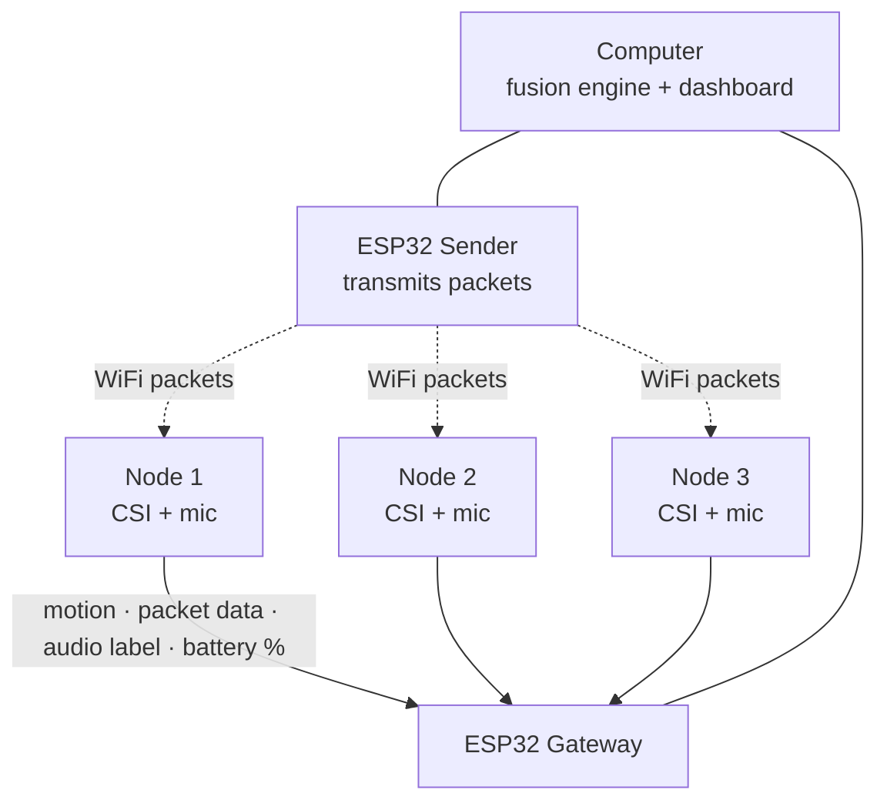

# Phase — see beyond the horizon

> A low-cost ESP32 sensor network that fuses **WiFi Channel State Information (CSI)** and **on-device audio classification** to detect people behind walls and under debris, and ranks where rescuers should search first.

Built in 36 hours at **ShellHacks 2026** (FIU, Miami).

---

## The challenge

In a rescue, every second spent searching the wrong spot can cost a life.

- **Listening devices can't tell a person from debris.** At the 2021 Surfside collapse, rescuers had to chase every sound, knowing it might be steel twisting or debris shifting rather than a person tapping or calling out.
- **Listening can't find unconscious victims.** Someone who is breathing but can't call for help makes no sound at all.

Radar tools that detect breathing exist, but they cost thousands of dollars each and scan one spot at a time.

## Our Solution

Place several cheap ESP32 nodes around a debris pile or burning building. Each node:

1. **Senses motion and breathing** through walls and debris using WiFi CSI, the tiny changes in radio signals caused by a moving or breathing body.
2. **Listens and classifies sound on-device** as human (voice, tapping) or non-human (debris, machinery, background noise). Raw audio never leaves the node.

The dashboard **fuses both signals** onto the building blueprint and produces a **live priority list** of zones to search.

### Why fusion matters

| Signal pattern at a node | Priority | Meaning |
|---|---|---|
| Breathing on CSI, **no** human sound | **P1 – Critical** | Likely unconscious; only detectable by fusion |
| CSI motion/breathing **+** voice or tapping | **P1 – High confidence** | Confirmed, responsive survivor |
| Human sound only, or CSI motion only (repeating) | **P2 – Probable** | Confirm with a second tool (dog, camera) |
| Single transient event, or debris-type sound | **P3 – Low** | Log and re-check |
| Nothing | **No signal detected** | **Never shown as "clear" or "empty"** |

---

## Features

- 📡 **CSI motion detection** across multiple sensor nodes, shown as a live heat map
- 🫁 **Breathing-band detection** (0.1–0.5 Hz) for still or unresponsive people <!-- remove if not working in final build -->
- 🔊 **Audio classification** on the node: human voice / tapping / background
- 🧠 **Sensor fusion scoring** with persistence windows, cross-node agreement, and signal decay
- 🗺️ **Blueprint upload** to map nodes and detections onto a real floor plan
- 📋 **Ranked rescue priority list** that re-sorts live

---

## Network Architecture 

We use a **star network**: every node reports directly to one central gateway.



1. **Sender** (connected to the computer) transmits packets continuously so nodes always have a signal to measure. A second sender can be added for more coverage.
2. **Nodes** capture CSI per packet and compute motion and breathing features. The onboard mic runs a small classifier and sends only the label and confidence. Each node also reports its battery level.
3. **Gateway** (connected to the computer) collects data from all nodes and passes it to the computer over [serial / USB — confirm].
4. **Fusion engine** on the computer combines CSI and audio per zone into a priority score.
5. **Dashboard** renders the heat map, blueprint overlay, and ranked list.

---

## Tech Stack

| Layer | Tools |
|---|---|
| Hardware | ESP32 [model, e.g. ESP32-S3] ×3, [microphone model], [power source] |
| Firmware | [ESP-IDF / Arduino], [esp-csi], [Edge Impulse / TFLite Micro] |
| Backend | [Python / Node], [database, e.g. Postgres / Tiger Data] |
| Frontend | [React / HTML], [charting / 3D library] |

---

## Getting Started

### Hardware you need
- ESP32 boards: 1–2 senders, 1 gateway, and 2+ nodes (nodes have microphones)
- USB cables or power banks for each node
- A laptop connected to the sender and gateway, running the dashboard

### 1. Flash the firmware
```bash
# Sender node
cd firmware/sender
[idf.py build flash monitor]   # replace with your actual command

# Receiver nodes
cd firmware/receiver
[idf.py build flash monitor]
```

### 2. Start the gateway
```bash
cd backend
[pip install -r requirements.txt]
[python gateway.py --port /dev/ttyUSB0]
```

### 3. Start the dashboard
```bash
cd dashboard
[npm install]
[npm run dev]
```
Open `http://localhost:[port]`.

### 4. Calibrate
Place the nodes, keep the area **empty for ~30 seconds**, and press **Calibrate** to record a baseline. Recalibrate if furniture or nodes move.

### 5. Try it
- Wave a hand between nodes → the zone lights up on the heat map
- Knock on a surface near a node → audio classifies "tapping" and the zone's priority rises

---

## Setup Requirements

- **Zone-level, not exact location.** With 3 nodes we detect which zone activity is in, not precise coordinates.
- **Short range.** Detection works over a few meters; performance drops through dense concrete and is blocked by metal.
- **Needs calibration.** CSI is sensitive to changes in the environment and needs an empty baseline.
- **Power-hungry.** CSI keeps the radio active continuously, so nodes need steady power.
- **Crowded 2.4 GHz.** Busy WiFi environments add noise; we use a dedicated sender node and a quiet channel.
- **Gateway range.** In a star network every node must be within radio range of the gateway, and the gateway is a single point of failure. A mesh (nodes relaying for each other) is on our roadmap for larger sites.
- **Multiple people** in one zone appear as a single detection.
- **Not yet field-validated.** Accuracy has only been tested in indoor rooms, not real rubble.

---

## Guardrails

This technology can find survivors, and it could also be misused to watch people. We built limits into the design:

- **Human in the loop.** The system recommends a search order; people decide. It never auto-dispatches or marks a zone safe.
- **"No signal" ≠ "no one."** The UI never labels a zone empty or cleared.
- **No raw audio.** Sound is classified on the node; only labels leave the device.
- **No identity.** The system detects presence and activity, not who someone is.
- **Authorized use only.** Intended for vetted emergency and public-safety agencies. For law-enforcement use in a home, sessions should require a logged warrant or declared emergency.
- **Audit trail and retention.** Sessions should log who, where, when, and under what authority; data should auto-delete after a set period. <!-- mark which of these are implemented vs. roadmap -->

---

## Use Cases

- **Collapsed-structure search and rescue** (primary): triage large debris fields and send dogs, cameras, and radar to the most likely zones first
- **Barricade and hostage situations:** know where people are in a room before entry
- **Firefighting:** RF sensing works through smoke, where cameras can't see
- **Hurricane aftermath:** fast welfare checks on damaged homes before crews enter

---

## Roadmap

- 🚁 **Drone-deployed nodes** that are dropped into position to form the network automatically
- 🕸️ **Mesh networking** so nodes relay data through each other, extending range and removing the single point of failure
- 🔋 Ruggedized, battery-powered nodes lasting a full operational period
- 🔐 Encrypted, authenticated node communication and signed firmware
- 🧍 Pose estimation research using the same CSI pipeline
- 🧪 Field testing with a local fire rescue training site

---

## Reference 

- [Espressif esp-csi](https://github.com/espressif/esp-csi) — CSI examples and tooling
- 
