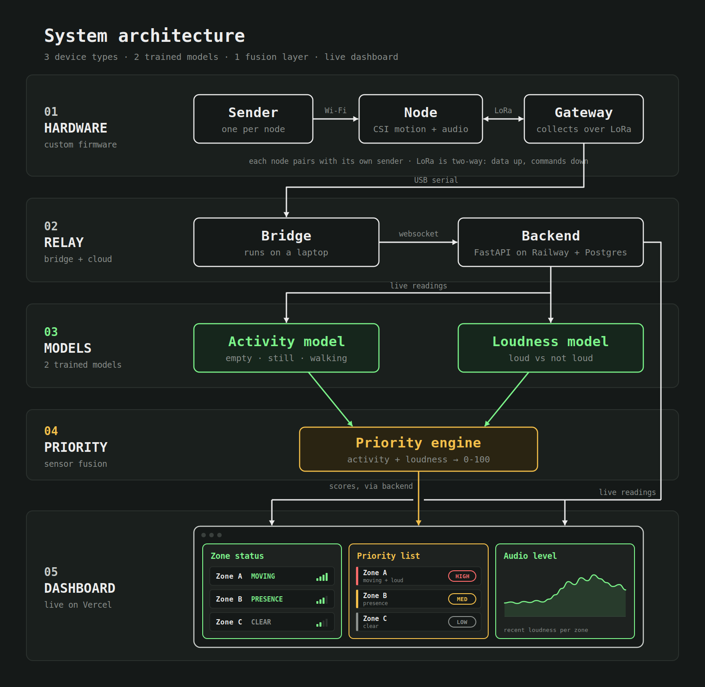
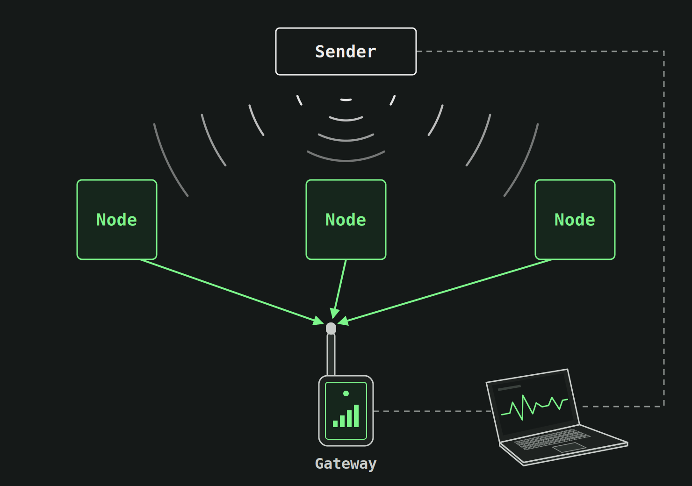

<h1 align="center">PHASE: See Beyond the Horizon</h1>

<h4 align="left">
PHASE is a network of microcontrollers that combines Wi-Fi sensing and audio analysis to help rescuers identify possible signs of life.
</h4>

Built in 36 hours at ShellHacks 2026 (FIU, Miami)

## Features

- CSI-based motion detection
- On-device audio classification
- Audio ML models
- CSI ML models
- Dynamic rescue priority list
- Real-time dashboard

## System Architecture

## Network Architecture

  

1. **Sender** (connected to the computer) transmits packets continuously so nodes always have a signal to measure. A second sender can be added for more coverage.
2. **Nodes** capture CSI per packet and compute motion and breathing features. The onboard mic runs a small classifier and sends only the label and confidence. Each node also reports its battery level.
3. **Gateway** (connected to the computer) collects data from all nodes and sends it to the computer over USB serial at 115200 baud, one JSON line per packet.
4. **ML Models** trained on real data captured by our hardware.
5. **Fusion engine** on the computer combines CSI and audio per zone into a priority score.
6. **Dashboard** visualize detections and rescue priorities. 

## Project Structure
- **Hardware:** sender, node, gateway
- **Backend:** Audio model, CSI model
- **sensor fusion:** priority engine
- **Frontend:** dashboard

## Use Cases

- Collapsed structure search and rescue
- Barricade and hostage situations: know where people are in a room before entry
- Firefighting: RF sensing works through smoke, where cameras can't see
- Disaster recovery

---

## Roadmap
- Drone-deployed nodes that are dropped into position to form the network automatically
- Mesh networking so nodes relay data through each other, extending range and removing the single point of failure
- Ruggedized, battery-powered nodes lasting a full operational period

---

## References

- https://github.com/espressif/esp-csi

