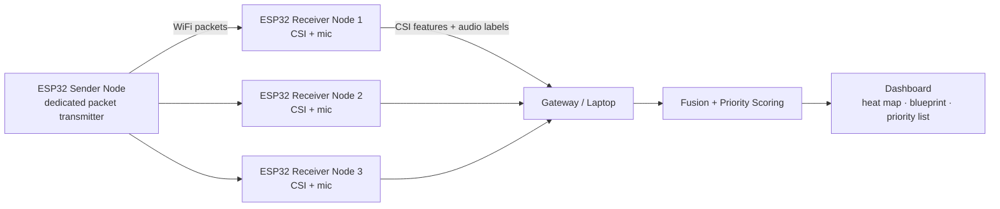

# shellhacks_2026
# [Project Name] — Finding Survivors Rescuers Can't See or Hear

> A low-cost ESP32 sensing mesh that fuses **WiFi Channel State Information (CSI)** and **on-device audio classification** to detect people behind walls and under debris, and ranks where rescuers should search first.

Built in 36 hours at **ShellHacks 2026** (FIU, Miami).
---

## The Problem

After a building collapse, rescuers race a survival clock across a huge debris field. Their tools have two big gaps:

- **Listening devices can't tell a person from debris.** At the 2021 Surfside collapse, rescuers had to chase every sound, knowing it might be steel twisting or debris shifting rather than a person tapping or calling out.
- **Listening can't find unconscious victims.** Someone who is breathing but can't call for help makes no sound at all.

Radar tools that detect breathing exist, but they cost thousands of dollars each and scan one spot at a time.

## Our Solution

Place several cheap ESP32 nodes around a debris pile or building. Each node:

1. **Senses motion and breathing** through walls and debris using WiFi CSI, the tiny changes in radio signals caused by a moving or breathing body.
2. **Listens and classifies sound on-device** as human (voice, tapping) or non-human (debris, machinery, background noise). Raw audio never leaves the node.

The dashboard **fuses both signals** onto the building blueprint and produces a **live priority list** of zones to search.

### Why fusion matters

| Signal pattern at a node | Priority | Meaning |
|---|---|---|
| Breathing on CSI, **no** human sound | **P1 – Critical** | Likely unconscious; only detectable by fusion |
| CSI motion/breathing **+** voice or tapping | **P1 – High confidence** | Confirmed, responsive survivor |
| Human sound only, or CSI motion only (repeating) | **P2 – Probable** | Confirm with a second tool (dog, camera) |
| Single transient event, or debris-type sound | **P3 – Low** | Log and re-check |
| Nothing | **No signal detected** | **Never shown as "clear" or "empty"** |

---

## Features

- 📡 **CSI motion detection** across a 3-node mesh, shown as a live heat map
- 🫁 **Breathing-band detection** (0.1–0.5 Hz) for still or unresponsive people <!-- remove if not working in final build -->
- 🔊 **Audio classification** on the node: human voice / tapping / background
- 🧠 **Sensor fusion scoring** with persistence windows, cross-node agreement, and signal decay
- 🗺️ **Blueprint upload** to map nodes and detections onto a real floor plan
- 📋 **Ranked rescue priority list** that re-sorts live

---

## How It Works



1. **Sender node** transmits packets continuously so receivers always have a signal to measure.
2. **Receiver nodes** capture CSI per packet and compute motion and breathing features. The onboard mic runs a small classifier and sends only the label and confidence.
3. **Gateway** collects data from all nodes over [serial / UDP / MQTT — pick one].
4. **Fusion engine** combines CSI and audio per zone into a priority score.
5. **Dashboard** renders the heat map, blueprint overlay, and ranked list.

---

## Tech Stack

| Layer | Tools |
|---|---|
| Hardware | ESP32 [model, e.g. ESP32-S3] ×3, [microphone model], [power source] |
| Firmware | [ESP-IDF / Arduino], [esp-csi], [Edge Impulse / TFLite Micro] |
| Backend | [Python / Node], [database, e.g. Postgres / Tiger Data] |
| Frontend | [React / HTML], [charting / 3D library] |

---

## Getting Started

### Hardware you need
- 3+ ESP32 boards (1 sender, 2+ receivers) with microphones on receivers
- USB cables or power banks for each node
- A laptop to run the gateway and dashboard

### 1. Flash the firmware
```bash
# Sender node
cd firmware/sender
[idf.py build flash monitor]   # replace with your actual command

# Receiver nodes
cd firmware/receiver
[idf.py build flash monitor]
```

### 2. Start the gateway
```bash
cd backend
[pip install -r requirements.txt]
[python gateway.py --port /dev/ttyUSB0]
```

### 3. Start the dashboard
```bash
cd dashboard
[npm install]
[npm run dev]
```
Open `http://localhost:[port]`.

### 4. Calibrate
Place the nodes, keep the area **empty for ~30 seconds**, and press **Calibrate** to record a baseline. Recalibrate if furniture or nodes move.

### 5. Try it
- Wave a hand between nodes → the zone lights up on the heat map
- Knock on a surface near a node → audio classifies "tapping" and the zone's priority rises

---

## Setup Requirements & Known Limitations

We want to be upfront about what this prototype can and can't do.

- **Zone-level, not exact location.** With 3 nodes we detect which zone activity is in, not precise coordinates.
- **Short range.** Detection works over a few meters; performance drops through dense concrete and is blocked by metal.
- **Needs calibration.** CSI is sensitive to changes in the environment and needs an empty baseline.
- **Power-hungry.** CSI keeps the radio active continuously, so nodes need steady power.
- **Crowded 2.4 GHz.** Busy WiFi environments add noise; we use a dedicated sender node and a quiet channel.
- **Multiple people** in one zone appear as a single detection.
- **Not yet field-validated.** Accuracy has only been tested in indoor rooms, not real rubble.

---

## Responsible Use (Guardrails)

This technology can find survivors, and it could also be misused to watch people. We built limits into the design:

- **Human in the loop.** The system recommends a search order; people decide. It never auto-dispatches or marks a zone safe.
- **"No signal" ≠ "no one."** The UI never labels a zone empty or cleared.
- **No raw audio.** Sound is classified on the node; only labels leave the device.
- **No identity.** The system detects presence and activity, not who someone is.
- **Authorized use only.** Intended for vetted emergency and public-safety agencies. For law-enforcement use in a home, sessions should require a logged warrant or declared emergency.
- **Audit trail and retention.** Sessions should log who, where, when, and under what authority; data should auto-delete after a set period. <!-- mark which of these are implemented vs. roadmap -->

---

## Use Cases

- **Collapsed-structure search and rescue** (primary): triage large debris fields and send dogs, cameras, and radar to the most likely zones first
- **Barricade and hostage situations:** know where people are in a room before entry
- **Firefighting:** RF sensing works through smoke, where cameras can't see
- **Hurricane aftermath:** fast welfare checks on damaged homes before crews enter

---

## Roadmap

- 🚁 **Drone-deployed nodes** that are dropped into position to form the mesh automatically
- 🔋 Ruggedized, battery-powered nodes lasting a full operational period
- 🔐 Encrypted, authenticated node communication and signed firmware
- 🧍 Pose estimation research using the same CSI pipeline
- 🧪 Field testing with a local fire rescue training site

---

## Team

| Name | Role |
|---|---|
| [Name] | Hardware & firmware |
| [Name] | Signal processing / ML |
| [Name] | Dashboard & visualization |
| Selena [Last name] | Presentation & business |

## AI Tools Used

In line with MLH rules, we used the following AI tools during the hackathon:
- [e.g. Claude — research, pitch, README drafting]
- [e.g. GitHub Copilot — code completion]

## Acknowledgments

- [Espressif esp-csi](https://github.com/espressif/esp-csi) — CSI examples and tooling
- [Any other open-source libraries you used]
- ShellHacks 2026 organizers, mentors, and INIT at FIU

## License

[MIT] <!-- choose a license; MLH requires the repo to stay public -->

## Live ESP32 display from Railway

The Python app polls a Railway HTTP GET endpoint and displays a stationary frequency spectrum. The frequency and amplitude axes stay fixed while the spectrum shape updates in place; the status indicator changes to `FEED INTERRUPTED` when a request fails. The selected sample channel is configured with `RAILWAY_SIGNAL_CHANNEL`, or defaults to the first numeric channel. Configure the service URL and route in PowerShell:

```powershell
$env:RAILWAY_API_URL = "https://your-service.up.railway.app"
$env:RAILWAY_DATA_ENDPOINT = "/api/data"
& '.\.venv\Scripts\python.exe' '.\shellhacks_2026\vizualizer.py'
```

Use your actual Railway URL and API route. The route should return JSON containing numeric fields, for example:

```json
{"timestamp": "2026-09-26T12:00:00Z", "ecg": 512, "temperature": 24.8}
```

Numeric arrays are also supported for batches, such as `{"ecg": [510, 512, 508]}`. The chart labels each numeric field as a separate channel. The poll interval defaults to 0.25 seconds and can be changed with `RAILWAY_POLL_INTERVAL`.

The Railway backend needs to expose the ESP32 readings through that GET route. If the ESP32 sends data to Railway using POST, the GET route should return the latest reading or a batch of recent readings. This project also needs Matplotlib installed in its selected Python environment.

## Run a local feed simulation

To view the live chart without Railway or an ESP32, run the local JSON feed simulator:

```powershell
& '.\.venv\Scripts\python.exe' '.\shellhacks_2026\simulate_feed.py'
```

It serves a changing ECG-like sample batch on a temporary local HTTP endpoint and opens the same visualizer. The simulator adds a 60 Hz interference burst after four seconds and brief HTTP outages, visible as a distinct spectrum peak and a `FEED INTERRUPTED` status. Close the chart window to stop the simulator.

The spectrum analyzes numeric samples; it does not identify Wi-Fi radio interference by itself. It currently assumes 512 samples per second and needs at least one second of uninterrupted samples to draw a spectrum. To diagnose RF link quality specifically, have the ESP32/backend also send RSSI and a packet sequence number or sample timestamp so actual packet loss can be distinguished from ordinary sensor changes.

## Live CSI environmental-change heatmap

The optional `csi_heatmap.py` view uses the existing Railway JSON client and leaves `vizualizer.py` and its spectrum processing unchanged. Since the repository has no ESP CSI firmware or real CSI endpoint yet, this view requires a backend route that returns amplitude values per CSI subcarrier. It displays **CSI Environmental Change**, not a person classification.

Supported response shapes include one CSI vector:

```json
{"timestamp": 123456, "csi_amplitude": [0.82, 0.91, 1.04, 1.12]}
```

or a batch of vectors:

```json
{"samples": [{"csi_amplitude": [0.82, 0.91, 1.04]}, {"csi_amplitude": [0.80, 0.93, 1.02]}]}
```

Explicit complex components are also accepted as `{"csi": {"real": [...], "imag": [...]}}`; the client converts those to magnitude. Raw interleaved ESP-IDF byte buffers are intentionally not guessed or decoded because their layout depends on the ESP model and firmware. The subcarrier count must remain constant during a calibration/run.

Set `RAILWAY_API_URL` and `RAILWAY_DATA_ENDPOINT` to the CSI-serving Railway route, make sure the monitored area is clear, then launch:

```powershell
$env:RAILWAY_API_URL = "https://your-service.up.railway.app"
$env:RAILWAY_DATA_ENDPOINT = "/api/csi"
& '.\.venv\Scripts\python.exe' '.\shellhacks_2026\csi_heatmap.py'
```

The first 40 CSI samples establish a per-subcarrier median baseline; keep the area clear until the UI says `BASELINE ESTABLISHED`. `Recalibrate` starts that process again. `Pause` freezes the display while feed processing continues. The horizontal dimension is recent CSI packets and the vertical dimension is the actual subcarrier index; this project has no node geometry in its real feed, so it does not claim to localize a disturbance in physical space.

The baseline deviation for each subcarrier is the current amplitude's absolute difference from its calibrated median, less a noise allowance based on three scaled median absolute deviations and a 0.5% baseline-relative floor. The remaining relative change is divided by the configured deviation scale and clipped to 0-1. A subcarrier median filter and exponential moving average then reduce speckle and jitter. Color runs continuously from clear orange (`0`) through yellow, green, and teal to blue-grey (`1`, largest measured deviation). The score reports environmental change only; it does not infer that the cause is a person.

Tuning variables: `CSI_BASELINE_SAMPLES` (40), `CSI_DEVIATION_SCALE` (0.35 relative change for full-scale color), `CSI_NOISE_SIGMA` (3.0), `CSI_RELATIVE_NOISE_FLOOR` (0.005), `CSI_SUBCARRIER_MEDIAN_WINDOW` (3, odd values only), `CSI_SMOOTHING_ALPHA` (0.4; lower is smoother), `CSI_HISTORY_SAMPLES` (160), and `CSI_CHANGE_THRESHOLD` (0.25 for the UI indicator). The color score itself remains continuous; the threshold only labels the current mean score.

The existing generic `/api/data` and `simulate_feed.py` provide ECG-like numeric samples, not CSI. Pointing the CSI heatmap at that route will show a feed error until the backend returns one of the CSI shapes above. `simulate_spatial_feed.py` remains an explicitly synthetic spatial-map demo and is not used as evidence of real CSI localization.

## Preview the spatial CSI map

The spatial demo uses a placeholder 4 m by 3 m room with six nodes and seven crossing links. It serves simulated CSI JSON based on [spatial_csi_sample.json](spatial_csi_sample.json), moves a simulated hand through the room, and paints blue for the unchanged empty-room baseline and red where affected links overlap:

```powershell
& '.\.venv\Scripts\python.exe' '.\shellhacks_2026\simulate_spatial_feed.py'
```

Each link in the feed includes `tx`, `rx`, `baseline_amplitude`, and `current_amplitude` arrays. Replace the placeholder room coordinates and simulated feed with calibrated measurements from the actual ESP Wi-Fi CSI links when the nodes are assembled. The map is a coarse RF disturbance estimate, not a literal image of a hand.
## Website showcase

A ShellHacks 2026 concept exploring human presence sensing with ESP32 nodes, a mesh network, and Wi-Fi channel state information (CSI). The website explains the idea and includes an interactive **simulation** of how a room overview might look. It does not display live device data.

## View the website

Install the dependencies once, then start the local development server:

```sh
npm install
npm run dev
```

Open the local address printed by Vite. The hero uses Three.js and WebGL, so opening `index.html` directly as a file will not load the 3D scene. To create a production build, run `npm run build`; the output is in `dist/`.

The hero loads the 3D scene immediately over a quiet background, then the room assembles in a short sequence; visitors who prefer reduced motion see the complete scene immediately. If WebGL is unavailable, a short message replaces the scene. The larger furnished room, two simplified standing people with green and blue presence areas, and soft node-to-person lines are illustrative. They are not live CSI, recovered body shapes, measured radio paths, or validated localization results.

## Customize it

- Replace every occurrence of `[PROJECT NAME]` in `index.html` and this README once the team chooses a name.
- Update the GitHub URL in `index.html` if the project moves.
- Keep the simulation language until actual sensor readings and validation support a live view.

## Files

- `index.html` — content and page structure
- `styles.css` — layout, responsive design, and animation
- `script.js` — mobile navigation, scenario controls, and scroll reveals
- `scene.js` — interactive Three.js cutaway room and entrance animation
- `favicon.svg` — site icon
- `package.json` / `package-lock.json` — dependencies and reproducible build

## Git quick start

`git status` shows changed files and your current branch. `git diff` shows your edits. `git add <file>` chooses what goes into the next snapshot. `git commit -m "message"` saves that snapshot locally. `git pull --rebase` brings in teammates' commits before yours, and `git push` shares your commits with GitHub.

Before working, run `git pull --rebase`. Before pushing, check `git status` and `git diff` so you know exactly what you are sharing.
