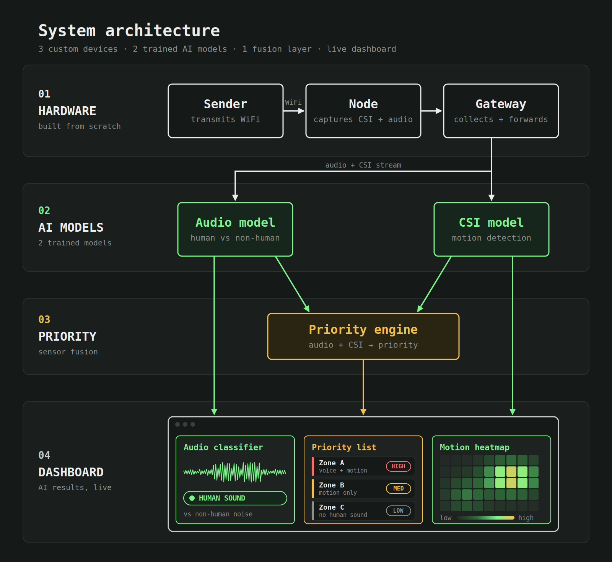

<h1 align="center">PHASE — See Beyond the Horizon</h1>

<h4 align="left">
PHASE is a network of microcontrollers that combines Wi-Fi sensing and audio analysis to help rescuers identify possible signs of life.
</h4>

Built in 36 hours at ShellHacks 2026 (FIU, Miami)

## Features

- CSI-based motion detection
- Microphone audio capture and an offline audio classification model
- CSI analysis and model experiments
- Proposed sensor-fusion priority list
- Live zone dashboard with a browser-only demo mode

## System Architecture

<p align="center">
  
</p>

1. **Sender** (connected to the computer) transmits packets continuously so nodes always have a signal to measure. A second sender can be added for more coverage.
2. **Nodes** capture CSI and microphone data for motion and audio analysis. The current gateway packets carry an audio level; live waveform and scream-score output still require integration.
3. **Gateway** (connected to the computer) collects data from all nodes and passes it to the computer over USB serial.
4. **ML models** for audio and CSI are under development; the current offline model artifacts are not called by the live bridge or backend.
5. **Fusion engine** is the intended layer for combining CSI and audio into a per-zone priority score.
6. **Dashboard** displays incoming zone readings and provides placeholders for model scores and a spatial heatmap.

## Project Structure

- **Hardware**: sender, node, gateway
- **Backend**: live ingest and recording service; audio and CSI model integration is in progress
- **Sensor fusion**: planned priority engine
- **Frontend**: zone readings, audio preview, priority concept, and heatmap placeholder

## Use Cases

- Collapsed structure search and rescue
- Barricade and hostage situations: know where people are in a room before entry
- Firefighting: RF sensing works through smoke, where cameras can't see
- Disaster recovery

---

## Roadmap
- Drone-deployed nodes that are dropped into position to form the network automatically
- Mesh networking so nodes relay data through each other, extending range and removing the single point of failure
- Ruggedized, battery-powered nodes lasting a full operational period

---

## References

- https://github.com/espressif/esp-csi

## CSI heatmap feed

The CSI heatmap can read a single subcarrier-amplitude vector:

```json
{"csi_amplitude": [0.82, 0.91, 1.04]}
```

It can also read a batch of vectors:

```json
{"samples": [{"csi_amplitude": [0.82, 0.91, 1.04]}, {"csi_amplitude": [0.80, 0.93, 1.02]}]}
```

Explicit complex components are also accepted as `{"csi": {"real": [...], "imag": [...]}}`; the client converts those to magnitude. Raw interleaved ESP-IDF byte buffers are intentionally not guessed or decoded because their layout depends on the ESP model and firmware. The subcarrier count must remain constant during a calibration/run.

Set `RAILWAY_API_URL` and `RAILWAY_DATA_ENDPOINT` to the CSI-serving Railway route, make sure the monitored area is clear, then launch:

```powershell
$env:RAILWAY_API_URL = "https://your-service.up.railway.app"
$env:RAILWAY_DATA_ENDPOINT = "/api/csi"
& '.\.venv\Scripts\python.exe' '.\csi_heatmap.py'
```

The first 40 CSI samples establish a per-subcarrier median baseline; keep the area clear until the UI says `BASELINE ESTABLISHED`. `Recalibrate` starts that process again. `Pause` freezes the display while feed processing continues. The horizontal dimension is recent CSI packets and the vertical dimension is the actual subcarrier index; this project has no node geometry in its real feed, so it does not claim to localize a disturbance in physical space.

The baseline deviation for each subcarrier is the current amplitude's absolute difference from its calibrated median, less a noise allowance based on three scaled median absolute deviations and a 0.5% baseline-relative floor. The remaining relative change is divided by the configured deviation scale and clipped to 0-1. A subcarrier median filter and exponential moving average then reduce speckle and jitter. Color runs continuously from clear orange (`0`) through yellow, green, and teal to blue-grey (`1`, largest measured deviation). The score reports environmental change only; it does not infer that the cause is a person.

Tuning variables: `CSI_BASELINE_SAMPLES` (40), `CSI_DEVIATION_SCALE` (0.35 relative change for full-scale color), `CSI_NOISE_SIGMA` (3.0), `CSI_RELATIVE_NOISE_FLOOR` (0.005), `CSI_SUBCARRIER_MEDIAN_WINDOW` (3, odd values only), `CSI_SMOOTHING_ALPHA` (0.4; lower is smoother), `CSI_HISTORY_SAMPLES` (160), and `CSI_CHANGE_THRESHOLD` (0.25 for the UI indicator). The color score itself remains continuous; the threshold only labels the current mean score.

The dashboard backend's `/api/data` returns zone readings, not CSI amplitude vectors. Pointing the CSI heatmap at that route will show a feed error until it returns one of the CSI shapes above. `simulate_spatial_feed.py` remains an explicitly synthetic spatial-map demo and is not used as evidence of real CSI localization.

## Preview the spatial CSI map

The spatial demo uses a placeholder 4 m by 3 m room with six nodes and seven crossing links. It serves simulated CSI JSON based on [spatial_csi_sample.json](spatial_csi_sample.json), moves a simulated hand through the room, and paints blue for the unchanged empty-room baseline and red where affected links overlap:

```powershell
& '.\.venv\Scripts\python.exe' '.\simulate_spatial_feed.py'
```

Each link in the feed includes `tx`, `rx`, `baseline_amplitude`, and `current_amplitude` arrays. Replace the placeholder room coordinates and simulated feed with calibrated measurements from the actual ESP Wi-Fi CSI links when the nodes are assembled. The map is a coarse RF disturbance estimate, not a literal image of a hand.

## Website showcase

A ShellHacks 2026 concept exploring human presence sensing with Wi-Fi channel state information (CSI). The website depicts a star network: one sender broadcasts to three ESP32 sensing nodes, which report to a central gateway connected to a display. It includes an interactive 3D illustration and a network architecture diagram; neither displays live device data.

## View the website

Install the dependencies once, then start the local development server:

```sh
npm install
npm run dev
```

Open the local address printed by Vite. The hero uses Three.js and WebGL, so opening `index.html` directly as a file will not load the 3D scene. To create a production build, run `npm run build`; the output is in `dist/`.

The hero loads the 3D scene immediately over a quiet background, then the room assembles in a short sequence; visitors who prefer reduced motion see the complete scene immediately. If WebGL is unavailable, a short message replaces the scene. The furnished room depicts one sender, three sensing nodes, one gateway, a display, and two simplified standing people with green and blue presence areas. The links illustrate the star topology, not live CSI, measured radio paths, recovered body shapes, or validated localization results.

## Customize it

- Update the GitHub URL in `index.html` if the project moves.
- Keep the 3D illustration and architecture diagram labeled as examples until actual sensor readings and validation support a live view.

## Files

- `index.html` — content and page structure
- `styles.css` — layout, responsive design, and animation
- `script.js` — mobile navigation and scroll reveals
- `system-architecture.png` — system-flow diagram used in section 01
- `network-architecture.png` — supplied star-network diagram used in section 02
- `scene.js` — interactive Three.js cutaway room and entrance animation
- `favicon.svg` — site icon
- `package.json` / `package-lock.json` — dependencies and reproducible build

## Git quick start

`git status` shows changed files and your current branch. `git diff` shows your edits. `git add <file>` chooses what goes into the next snapshot. `git commit -m "message"` saves that snapshot locally. `git pull --rebase` brings in teammates' commits before yours, and `git push` shares your commits with GitHub.

Before working, run `git pull --rebase`. Before pushing, check `git status` and `git diff` so you know exactly what you are sharing.

## Dashboard audio data

The landing page links to the root `dashboard.html`. It connects automatically to the Railway backend's existing `/ws/live` WebSocket and retries if the connection drops. The gateway-to-backend bridge must also be running for new readings to arrive. The separate `backend/static/dashboard.html` includes a manual backend connection control and browser-only demo mode for development.

Each dashboard card belongs to the reading's `zone`. The live dashboard accepts two optional fields alongside the existing motion and audio-level fields:

```json
{"zone":"A","ts":"2026-09-27T12:00:00Z","state":"CLEAR","motion":0.06,"audio_db":43,"audio_waveform":[-0.2,0.1,0.4,-0.1],"scream_score":0.82}
```

`audio_waveform` is an array of at least two microphone samples normalized to -1 through 1; it is a display preview, not the model's input. `scream_score` is a model output from 0 through 1. The dashboard shows missing fields as unavailable instead of constructing a waveform or classification from the audio level. Its demo mode generates illustrative values only in the browser.

The computer bridge also accepts optional `w` (waveform) and `sc` (score) fields in a gateway JSON line and forwards them under these names. It caps the waveform preview at 96 points. The current node and gateway firmware transmit only an audio-level number, so real waveforms and scores require firmware/protocol work and a live inference pipeline. The existing `.keras` file and `audio_model.py` are offline model artifacts; they are not called by the node, bridge, or backend. The current model preprocessing expects 44.1 kHz, 10-second WAV input, while node audio capture is 16 kHz. Live classification needs compatible preprocessing and validation before its score can be treated as an actionable signal. These optional fields are broadcast live but are not stored in recording sessions.

## Dashboard spatial heatmap

The dashboard has a spatial heatmap placeholder below the zone cards. In demo mode it shows a synthetic A/B activity illustration. Without a spatial map payload it stays empty; two zone motion scores are not enough to estimate positions inside a room.

The dashboard accepts an optional `spatial_heatmap` object on a zone reading. It contains `width`, `height`, and a row-major `values` array of calibrated CSI-change intensities from 0 to 1. The bridge accepts the same object as `hm` in a gateway JSON line. The backend broadcasts it with the reading. For example, a 4-by-3 map has 12 values:

```json
{"zone":"A","ts":"2026-09-27T12:00:00Z","spatial_heatmap":{"width":4,"height":3,"values":[0,0.1,0.2,0,0.1,0.6,0.8,0.1,0,0.2,0.3,0]}}
```

The dashboard accepts grids from 4-by-3 through 32-by-24 and hides a map after three seconds without a new one. The existing `csi_heatmap.py` plots change by subcarrier and time; `spatial_visualizer.py` can display a link cross-section from the separate synthetic CSI feed. Neither currently produces a live, calibrated spatial grid for this dashboard. The node/gateway protocol and spatial reconstruction need to be extended before real heatmap values can appear. Map values are live-only and are not saved in recording sessions.
