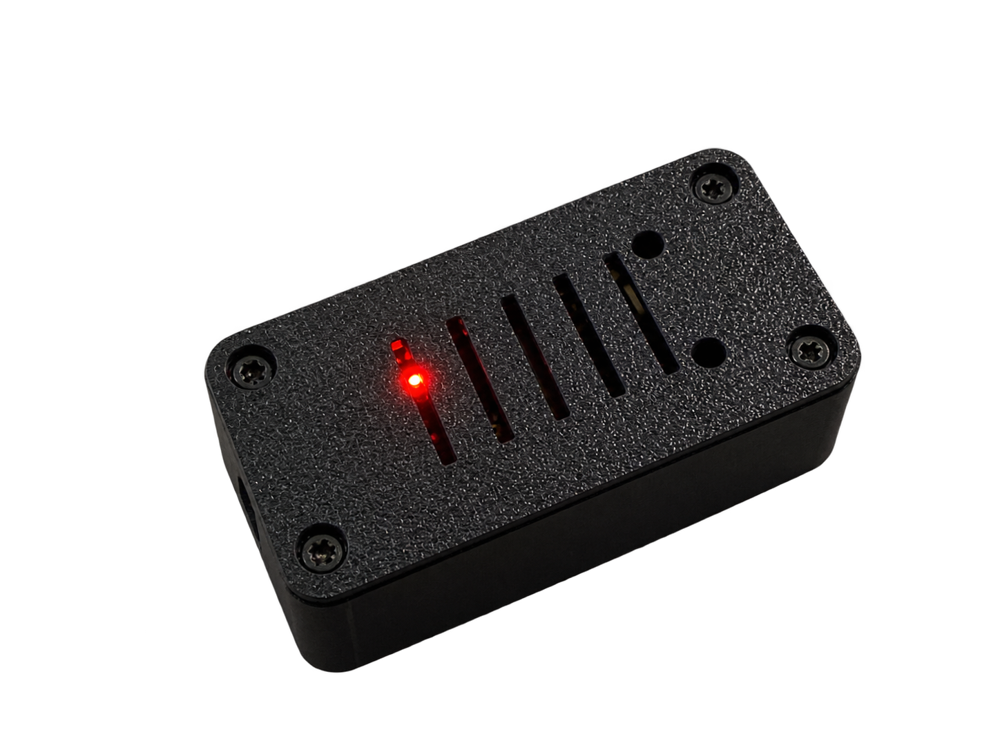
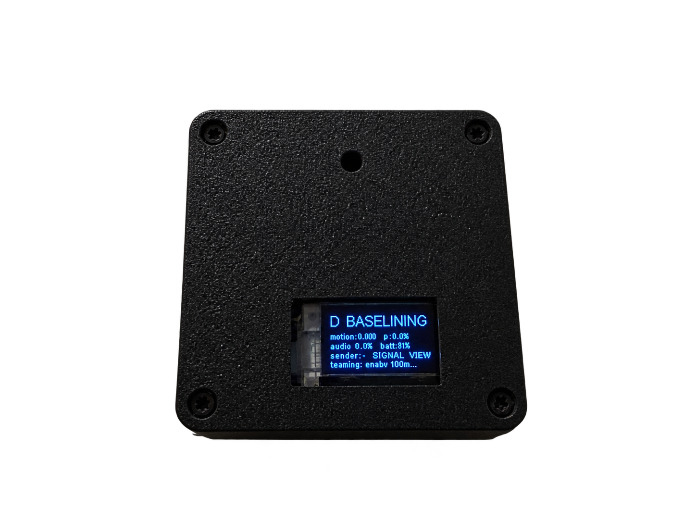
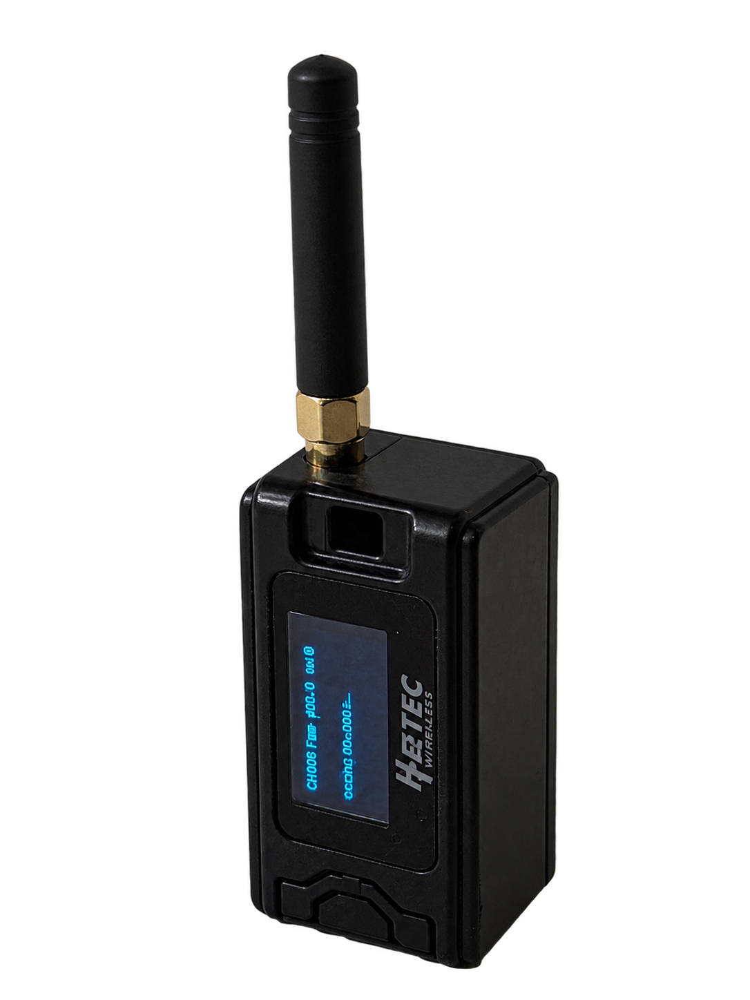

<h1 align="center">PHASE: See beyond the horizon</h1>

<p align="center">PHASE is a network of microcontrollers that combines Wi-Fi sensing and audio analysis to help rescuers identify possible signs of life.</p>

<p align="center">Built in 36 hours at ShellHacks 2026 (FIU, Miami).</p>

## Live dashboard

Open it here: [https://shellhacks-2026.vercel.app/dashboard.html](https://shellhacks-2026.vercel.app/dashboard.html)

No hardware needed. When no sensors are connected, the dashboard automatically shows clearly labeled sample data (marked "Showing sample data") so you can see how it behaves. That sample data is illustrative and is never recorded.

## The problem

When a building collapses or fills with smoke, rescuers cannot see where people are. Cameras are little help: rubble blocks the view and smoke blinds them. Teams often have to search blind, room by room, while time runs out.

## What PHASE does

PHASE is a set of small sensor nodes that you place around a search area. Each node watches how a Wi-Fi signal scatters through the space to pick up motion, and listens with a microphone for how loud the room is. A gateway collects every node's report over radio, a laptop relays it to a cloud backend, and a live dashboard ranks each zone by how likely someone is present.

The nodes are placed deliberately around the area, not thrown or scattered. Coverage comes from where you set them.

## Use Cases

- Collapsed structure search and rescue
- Barricade and hostage situations: know where people are in a room before entry
- Firefighting: radio sensing works through smoke, where cameras cannot see
- Disaster recovery

## How it works

![System architecture in five layers: hardware (a sender, a node, and a gateway, with one sender per node, Wi-Fi from sender to node and two-way LoRa between node and gateway), relay (a bridge on a laptop and a FastAPI backend on Railway with Postgres, over USB serial and a websocket), two trained models (an activity model for empty, still, and walking, and a loudness model for loud versus not loud), a priority engine that fuses activity and loudness into a 0 to 100 score, and a live dashboard on Vercel showing zone status, a priority list, and an audio level graph.](images/System-Architecture.png)

The pipeline runs sender to node to gateway to bridge to backend to dashboard:

1. **Sender to node (Wi-Fi).** Each node has its own paired sender, one sender per node. The sender joins the node's Wi-Fi access point and transmits about 100 packets per second. The node measures the Channel State Information (CSI) of those frames, which is how the Wi-Fi signal's amplitude is distributed across subcarriers, and that pattern changes when something in the room moves.
2. **Node to gateway (LoRa).** Each node sends a compact reading to the gateway over two-way long range radio (LoRa). The link is two-way: readings go up, and the gateway's reply can carry a command back down.
3. **Gateway to bridge (USB serial).** The gateway collects packets from all nodes and prints one JSON line per packet to USB serial at 115200 baud.
4. **Bridge to backend (websocket).** A small Python bridge on a laptop reads those lines, stamps each with a real timestamp, and forwards them to the backend over a websocket.
5. **Backend to dashboard.** The FastAPI backend fans readings out to any connected dashboard and, when recording, stores them in Postgres.


## Hardware

Each zone uses one sender paired with one node. One gateway serves all zones.

| Role | Board | Key parts and job |
| --- | --- | --- |
| Sender | HiLetgo ESP32-WROOM-32 | Joins the paired node's Wi-Fi access point and transmits User Datagram Protocol (UDP) packets at about 100 per second, so the node always has frames to measure. |
| Node | Heltec WiFi LoRa 32 V3 (ESP32-S3) | SX1262 LoRa radio, INMP441 microphone on an I2S bus, 0.96 inch SSD1306 OLED screen, and a battery voltage divider for the battery gauge. Runs its own Wi-Fi access point, reads CSI, scores motion, measures sound level, and reports over LoRa. |
| Gateway | Heltec WiFi LoRa 32 V3 (ESP32-S3) | SX1262 LoRa radio with an external antenna and a 0.96 inch SSD1306 OLED screen. Receives packets from every node, replies to each, and prints JSON to USB serial. |

<p align="center">
  
  
  
</p>

## Firmware highlights

The node firmware ([hardware/node/node.ino](hardware/node/node.ino)) does the real sensing work:

- **Self-calibrating empty-room baseline.** On boot, and whenever told to re-baseline, a node spends 15 seconds learning the empty room: the first two thirds learn the average shape of the Wi-Fi amplitude across 52 subcarriers, and the last third learns how much a still room naturally jitters.
- **Motion scoring.** Every packet is normalized (the Wi-Fi chip rescales each frame, so only the shape matters), compared to the baseline as a mean absolute deviation across subcarriers, and expressed as how many "still-room sigmas" above normal jitter it is. The score is clamped to a 0 to 2 range and smoothed over time. A still, empty room slowly re-centers its own baseline, so the score drifts back toward zero.
- **Presence and moving states with hysteresis.** The smoothed motion score must stay above 0.20 for 1 second to declare PRESENCE, and must drop below 0.15 for 1.5 seconds to return to CLEAR. Above 0.35 while present, the state becomes MOVING. The two different thresholds and hold times keep the state from flickering.
- **Two-way LoRa with acknowledgements.** Nodes send a 10 byte reading every 500 milliseconds and then listen about 150 milliseconds for the gateway's reply. The reply can carry a command: re-learn the baseline (B) or reboot (R), typed into the gateway's serial monitor as `B A` or `R A`. The node acknowledges the command before acting on it.
- **Retries and radio re-init.** After 3 unanswered uplinks a node immediately retransmits the last packet. After 20 it re-initializes its radio.
- **Watchdog.** A 10 second hardware watchdog resets the node if its main loop stalls.
- **Staggered uplinks.** Each zone offsets its transmissions so nodes on 500 millisecond cycles do not collide on the air.

Packet formats are shared between node and gateway in [hardware/node/ghost_protocol.h](hardware/node/ghost_protocol.h).

## Backend and dashboard

The backend ([backend/main.py](backend/main.py)) is a FastAPI service deployed on Railway.

- **Session recording.** When a `DATABASE_URL` is set, the backend records sessions and their readings to Postgres (see [backend/db.py](backend/db.py)). Without a database, it runs in memory only.
- **Live websocket feed.** Browsers connect to a websocket and receive a snapshot followed by live readings and predictions as they arrive.

The dashboard ([frontend/dashboard.html](frontend/dashboard.html)) is deployed on Vercel and shows:

- A **priority-sorted zone list** with High, Medium, and Low badges, ordered by the fused activity score.
- A **CALIBRATING** state while a node is still learning its empty-room baseline.
- An **audio level graph** built from each zone's recent sound-level readings.
- **Signal strength bars** (Strong, Good, Fair, Weak) from the radio's received signal strength indicator (RSSI).
- An **automatic demo mode** that shows labeled sample data when nothing live is connected.

## Models

Two models are trained today, and a third is experimental.

**Activity classifier** ([ml/train_activity.py](ml/train_activity.py), run live by [ml/classify_live.py](ml/classify_live.py)). It reads a window of recent readings and builds a fixed feature vector: six summary statistics of the motion score (mean, standard deviation, minimum, maximum, range, and mean absolute difference between samples), a count of how many times motion crosses a threshold, the same six statistics of the audio level, the fraction of readings flagged as presence, and the mean RSSI. Its classes are **empty**, **still**, and **walking**. It was trained on readings captured by our own hardware. The dataset in [data/dataset.json](data/dataset.json) holds 508 windows across 6 recording sessions, all from a single node (zone A).

**Loudness model** ([ml/audio_model.py](ml/audio_model.py)). It classifies **loud versus not loud** from the node's audio level readings (a relative decibel value per window). The training labels are generated from a loudness threshold rather than hand-labeled, and the saved settings are in [ml/audio_model_meta.json](ml/audio_model_meta.json). This model reacts to loudness patterns, not to human voices.

**Fusion** ([ml/monitor_live.py](ml/monitor_live.py)). This script polls the backend's live readings, runs the activity and loudness models per zone, and combines them into the 0 to 100 activity score that drives the priority list. The score averages the chance a zone is not empty (from the activity model) and the chance it is loud (from the loudness model). It posts the result back to the backend.

**Scream model** ([ml/classify_audio_live.py](ml/classify_audio_live.py)). This is experimental. It runs on a laptop microphone using 10 second windows and is not wired into the dashboard yet.

## Getting started

### 1. Flash the firmware

- Use the Arduino IDE with the ESP32 board support package.
- Boards: the node and gateway are the Heltec WiFi LoRa 32 V3; the sender is a generic ESP32 (HiLetgo ESP32-WROOM-32).
- Libraries the code includes: RadioLib (for the SX1262 radio) and the ThingPulse ESP8266 and ESP32 OLED driver for the SSD1306 screen. The Wi-Fi, CSI, I2S, and watchdog support ship with the ESP32 core.
- Edit the `config.h` in each folder before flashing:
  - [hardware/node/config.h](hardware/node/config.h): set `ZONE_ID` (A, B, or C, unique per node), `NODE_AP_SSID`, and the motion thresholds.
  - [hardware/sender/config.h](hardware/sender/config.h): set `NODE_AP_SSID` to match the node this sender pairs with.
  - [hardware/gateway/config.h](hardware/gateway/config.h): the LoRa settings (frequency, sync word, bandwidth) must match the nodes.
- Flash one node and one sender per zone, plus one gateway.

### 2. Run the backend

- Install [backend/requirements.txt](backend/requirements.txt) (FastAPI, uvicorn, asyncpg).
- Set these environment variables:
  - `GHOST_INGEST_TOKEN`: shared secret for uploads and session control. The backend rejects every protected request if this is unset.
  - `DATABASE_URL`: Postgres connection string for session recording. Optional; without it the backend runs without persistence.
  - `ALLOWED_ORIGINS`: comma-separated browser origins allowed by Cross-Origin Resource Sharing (CORS). Defaults to the Vercel dashboard.
- Start it with uvicorn. On Railway this happens automatically.

### 3. Run the bridge

- Connect the gateway by USB.
- Install [bridge/requirements.txt](bridge/requirements.txt) (pyserial and websockets).
- Set `GHOST_INGEST_TOKEN` (or pass `--token`), then run:

  ```
  python bridge/ghost_bridge.py --port COM5 --url wss://<your-app>.up.railway.app --token <token>
  ```

- Use the COM port your gateway appears as.

### 4. Run the models (optional, for the priority list)

- Install [ml/requirements-ml.txt](ml/requirements-ml.txt).
- Run the fusion monitor:

  ```
  python ml/monitor_live.py --url https://<your-app>.up.railway.app --token <token>
  ```

- It polls the backend, runs both models per zone, and posts fused scores back so the dashboard can rank zones.

### 5. Record a session

- Open the dashboard, enter the operator token (the same `GHOST_INGEST_TOKEN`), add a label, and press Start. Readings are written to Postgres until you press Stop. [ml/fetch_dataset.py](ml/fetch_dataset.py) pulls recorded sessions back out for training.

## Security

- The bridge and the model scripts send the token in an `X-Ghost-Token` header.
- The backend fails closed: if `GHOST_INGEST_TOKEN` is not set, every protected request is rejected.
- Public without a token: the live dashboard feed, the latest readings, and the health check.
- Token required: starting and stopping sessions, listing and reading session history, and all data upload (the ingest websocket and prediction posting).
- The LoRa link between nodes and the gateway is not authenticated yet. Packets carry a fixed marker byte, a sync word, and a cyclic redundancy check (CRC), but nothing cryptographic, so anyone using the same radio settings could read or inject packets.

## Limitations

- This is a hackathon prototype, built in 36 hours.
- The activity model was trained on a small dataset: 508 windows from 6 sessions, all from a single node in one room, so it will not transfer cleanly to new rooms without more data.
- CSI sensing depends heavily on where the nodes are placed and on wall material, so results vary between spaces.
- The audio model detects loudness, not voices, in the live path.
- One sender per node: each node needs its own paired sender, so coverage scales with how much hardware you deploy.

## Roadmap

- Drone-deployed nodes that are dropped into position to form the network automatically
- Mesh networking so nodes relay data through each other, extending range and removing the single gateway as a point of failure
- Ruggedized, battery-powered nodes lasting a full operational period
- On-node audio classification, so loudness and sound labels are computed on the node instead of on a laptop
- Authenticated LoRa messages between nodes and the gateway

## Acknowledgments

[Espressif ESP-CSI](https://github.com/espressif/esp-csi)

## A note on the name

PHASE was originally called GHOST, and some of the code still uses that name. You will see it in the Wi-Fi SSIDs (for example `GHOST-N-A`), the `GHOST_INGEST_TOKEN` environment variable, [bridge/ghost_bridge.py](bridge/ghost_bridge.py), and the `ghost_protocol.h` packet definitions.
